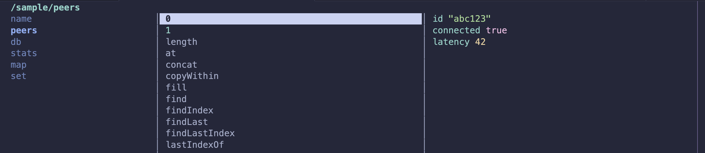
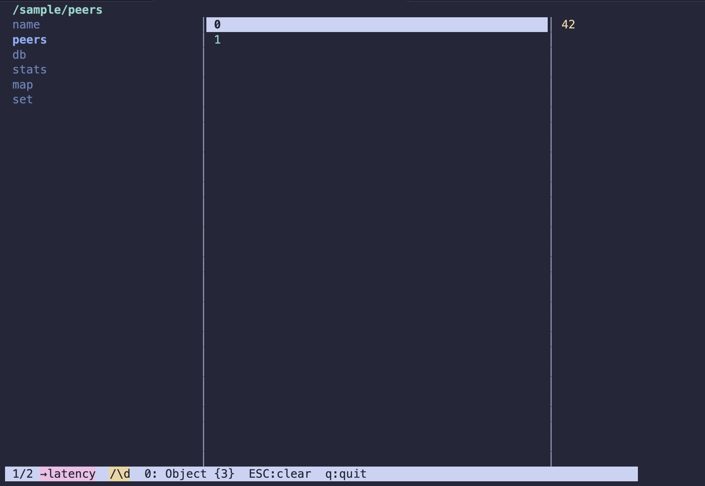

# bugbear

> a persistent source of annoyance — now useful

Debug event logger and live navigator for [Bare](https://github.com/holepunchto/bare). Log structured events to a JSONL file from anywhere in your app, then browse them in a ranger-style TUI — drill into objects, filter, select, and page through data.

Designed for debugging and inspecting, not for production use.

## Install

```
npm install bugbear
```

## Log events

```js
const bugbear = require('bugbear')

const log = bugbear('hyperswarm')
log({ event: 'peer-added', peers: 4 })
log({ level: 'error', msg: 'connection refused', code: 111 })
```

`bugbear(scope)` returns a scoped logger. Every call captures a stack trace. `level` is optional — include it as a key if you want it.

Buffers, Maps, Sets, and BigInts are serialized safely and restored when browsing.

### Nested scopes

```js
const log = bugbear(['hyperswarm', 'peers'])
log({ event: 'connected', id })
```

Nested scopes appear as drillable nodes in the navigator.

### Custom log file

```js
const log = bugbear('hyperswarm', { file: './debug.jsonl' })
```

The default file is `./bugbear.jsonl`.

## Global

`__bugbear` is available everywhere without passing it around:

```js
require('bugbear')

const log = __bugbear('hyperswarm')
log({ event: 'peer-added', peers: 4 })

// or

__bugbear('hyperswarm')({ event: 'peer-added', peers: 4 })
```

bugbear registers itself at `globalThis.__bugbear` — one instance shared across every module, no matter how many times it's required.

## Navigator

Run the CLI to browse your logs:

```sh
bugbear                          # open ./bugbear.jsonl
bugbear ./debug.jsonl            # open a specific file
bugbear --file ./debug.jsonl
```

The navigator watches the file for new entries and updates live. It works with any JSONL file — bugbear's own format is just regular JSONL with special-type encoding.

The three-column layout shows **parent | current | preview**. The current path is shown at the top.



### Keys

| key                 | action                                   |
| ------------------- | ---------------------------------------- |
| `j` / `↓`           | down                                     |
| `k` / `↑`           | up                                       |
| `l` / `→` / `enter` | drill in                                 |
| `h` / `←` / `esc`   | go up                                    |
| `g`                 | top                                      |
| `G`                 | bottom                                   |
| `s`                 | toggle selection on current item         |
| `v`                 | visual mode — range select               |
| `c`                 | clear all selections                     |
| `/`                 | filter — type regex, `enter` to confirm, `esc` to clear |
| `m`                 | map — type a dot-path to preview a sub-field across all items |
| `p`                 | pager — scrollable expanded view of selected (or current) items |
| `x`                 | cycle buffer encoding: hex → z32 → raw  |
| `q` / `ctrl+c`      | exit                                     |

Filter and map compose: `/\d` to narrow to numeric keys, then `m` + `latency` to show just that field across every item in the preview column.



## License

Apache-2.0
